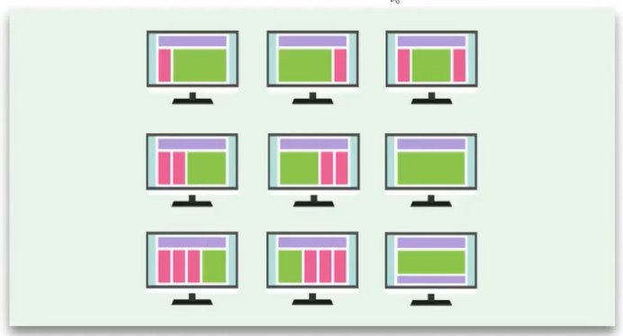

# Layout
## O que é um Layout?

Se usarmos o tradutor, nós temos a seguinte definição: 

"Modo de distribuição e arranjo dos elementos gráficos num determinado espaço ou superfície."

## Layouts

Existem diversos tipos de layouts no CSS, sendo que os principais são: **normal-flow, flex-box e grid.**

Nessa aula nós trataremos do normal-flow, que é o layout default do CSS.

## Layouts adaptativos

Se você navega pela internet usando o **celular** e também o **computador**, deve ter notado que na maioria dos sites (de alguma relevância) nós temos uma **adaptação** para que seja possível usá-lo em qualquer **dispositivo**.

## Responsivo x Fluido

O Layout **responsivo** é aquele que se adapta exatamente a uma tela de qualquer dispositivo, com as melhores usabilidades para aquele dispositivo.

Já o Layout **fluido**, ele é criado de forma que possa ser utilizado em qualquer dispositivo, porém ele nem sempre tem as melhores regras e a melhor usabilidade.

Vejamos na prática como funciona isso...

## Container

No **frontend** um container é algo que envolve outras coisas, como assim?

Por exemplo, uma `ul` tem várias `li`, logo essa `ul` é um **container** para `li`.

O nome faz alusão aos contêineres de transporte, onde eles servem para colocar outras coisas dentro.

## Explicação do Conteúdo
O que é um Container no Frontend?

Em desenvolvimento web frontend, um container é um elemento **HTML** que serve para agrupar outros elementos. É como um recipiente que contém outros itens. Essa analogia é feita com os contêineres de transporte, que servem para transportar diversos objetos.

**Exemplo:**  

`<ul></ul>`: Uma lista não ordenada `(ul)` é um container para os itens da lista `(li)`. Cada item `(li)` está dentro da lista (ul).

Por que usar Containers?

**Organização**: Agrupa elementos relacionados, facilitando a estruturação do código e a manutenção.

**Estilização:** Permite aplicar estilos a um grupo de elementos de uma só vez.

**Layout:** Ajuda a criar layouts mais complexos e responsivos.

**Flexbox e Grid:** São modelos de layout que dependem de containers para organizar os elementos dentro deles.

### Em resumo:

Containers são elementos fundamentais no desenvolvimento web, pois proporcionam uma maneira eficiente de organizar e estruturar o conteúdo de uma página. Eles são como caixas que você utiliza para organizar seus pertences, mas no mundo digital.

## Positions

Existem propriedades que nos ajudam a posicionar, elas são os positions, nós temos algumas variações, veja abaixo:

- static
- relative
- absolute
- fixed
- sticky